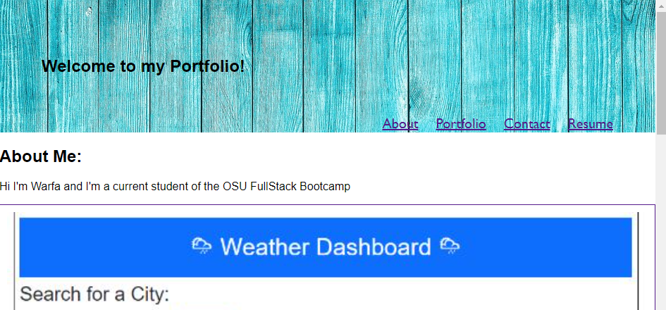

# Portfolio

Built using React.

## Table of Contents
* [Description](#description)
* [Deployed Site](#deployed-site)
* [Usage](#usage)
* [Licenses](#licenses)
* [Contact](#contact)
* [Credits](#credits)

## Description
As a student, I wanted to build a professional portfolio to showcase my skills and talents to employers. This portfolio includes all the deployed web applications I have created throughout my career. I plan on showcasing my skills learned to hopefully land an interview.

## Deployed Site 

Below is a screenshot of and link to deployed site

https://warfaha.github.io/portfolio/

## Usage

Navigate freely to each section of my portfolio by using the navbar, and visit each project by clicking the image to view the repo. 

## Licenses

To view the MIT license. Click the license button above.

## Contact

If you have any additional questions, here's how to reach me.

GitHub: https://github.com/WarfaHa  
Email: Warfa60@gmail.com

## Credits

All images used were royalty free from https://pixabay.com/  
This portfolio was created by Warfa Hassan.